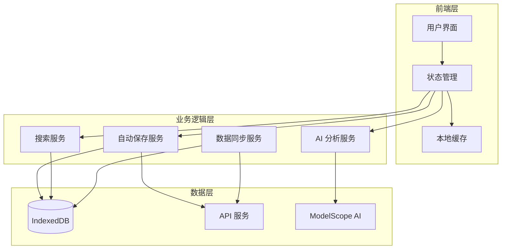
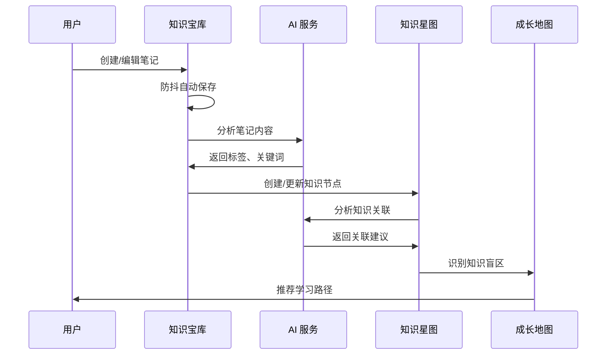

# 功能整合和用户体验优化 - 设计文档

**项目代号**: Integration & UX Optimization
**版本**: v1.0
**创建日期**: 2026-03-09
**负责人**: EduNexus 开发团队
**状态**: 设计阶段

---

## 📋 目录

1. [项目概述](#项目概述)
2. [核心目标](#核心目标)
3. [系统架构](#系统架构)
4. [功能设计](#功能设计)
5. [数据模型](#数据模型)
6. [UI/UX 设计规范](#uiux-设计规范)
7. [技术选型](#技术选型)
8. [风险评估](#风险评估)

---

## 项目概述

### 背景

EduNexus 目前拥有三大核心功能模块：
- **知识宝库**：笔记管理和知识存储
- **知识星图**：知识可视化和关联分析
- **成长地图**：学习路径和技能树

这些模块目前相对独立，用户需要在不同页面间切换，学习体验不够流畅。本项目旨在打通三大功能，实现智能化、一体化的学习体验。

### 愿景

打造一个智能化、沉浸式的学习平台，让用户能够：
- 无缝创建和管理学习内容
- 自动发现知识关联和学习路径
- 获得个性化的学习建议
- 享受流畅、美观的交互体验


---

## 核心目标

### 主要目标

1. **提升创作效率**
   - 实现防抖自动保存，减少手动保存操作
   - 提供多入口快速创建，降低创作门槛
   - 智能模板推荐，加速内容创建

2. **增强智能化**
   - AI 自动分析笔记内容，提取关键信息
   - 智能推荐学习路径，个性化学习建议
   - 识别知识盲区，针对性补充学习

3. **优化用户体验**
   - 统一设计语言，提升视觉一致性
   - 流畅动画效果，增强交互反馈
   - 沉浸式编辑体验，减少干扰

4. **打通数据流转**
   - 知识宝库 ↔ 知识星图：笔记自动生成知识节点
   - 知识星图 ↔ 成长地图：知识盲区生成学习任务
   - 成长地图 ↔ 知识宝库：学习任务关联笔记资源

### 成功指标

| 指标 | 当前值 | 目标值 | 测量方式 |
|------|--------|--------|----------|
| 笔记创建时间 | ~2分钟 | <30秒 | 用户行为分析 |
| 自动保存成功率 | N/A | >99% | 系统日志 |
| 知识关联准确率 | N/A | >80% | 用户反馈 |
| 用户满意度 | N/A | >4.5/5 | 用户调研 |
| 页面加载时间 | ~2秒 | <1秒 | 性能监控 |

---

## 系统架构

### 整体架构图



### 数据流转图



---

## 功能设计

### 第一阶段：核心功能（1-2周）

#### 1.1 防抖自动保存系统

**功能描述**
- 用户停止输入 2-3 秒后自动保存
- 保存状态实时反馈
- 离线保存支持
- 冲突检测和解决

**技术实现**

```typescript
// 自动保存 Hook
interface AutoSaveOptions {
  delay?: number;           // 防抖延迟（毫秒）
  onSave: (data: any) => Promise<void>;
  onError?: (error: Error) => void;
  onSuccess?: () => void;
}

function useAutoSave<T>(options: AutoSaveOptions) {
  const [status, setStatus] = useState<'idle' | 'saving' | 'saved' | 'error'>('idle');
  const [lastSaved, setLastSaved] = useState<Date | null>(null);
  
  const debouncedSave = useMemo(
    () => debounce(async (data: T) => {
      try {
        setStatus('saving');
        await options.onSave(data);
        setStatus('saved');
        setLastSaved(new Date());
        options.onSuccess?.();
      } catch (error) {
        setStatus('error');
        options.onError?.(error as Error);
      }
    }, options.delay ?? 2000),
    [options]
  );
  
  return { save: debouncedSave, status, lastSaved };
}
```

**状态指示器**

```typescript
// 保存状态组件
function SaveStatusIndicator({ status, lastSaved }: {
  status: 'idle' | 'saving' | 'saved' | 'error';
  lastSaved: Date | null;
}) {
  const statusConfig = {
    idle: { icon: Clock, text: '未保存', color: 'text-gray-400' },
    saving: { icon: Loader, text: '保存中...', color: 'text-blue-500' },
    saved: { icon: Check, text: '已保存', color: 'text-green-500' },
    error: { icon: AlertCircle, text: '保存失败', color: 'text-red-500' },
  };
  
  const config = statusConfig[status];
  const Icon = config.icon;
  
  return (
    <div className="flex items-center gap-2">
      <Icon className={`w-4 h-4 ${config.color}`} />
      <span className={`text-sm ${config.color}`}>{config.text}</span>
      {lastSaved && (
        <span className="text-xs text-gray-400">
          {formatDistanceToNow(lastSaved, { addSuffix: true })}
        </span>
      )}
    </div>
  );
}
```

#### 1.2 多入口快速创建系统

**功能描述**
- 全局快捷键（Ctrl/Cmd + N）
- 浮动创建按钮（右下角）
- 智能创建（根据上下文）
- 模板快速选择

**实现方案**

```typescript
// 全局快捷键管理
function useGlobalShortcuts() {
  useEffect(() => {
    const handleKeyDown = (e: KeyboardEvent) => {
      // Ctrl/Cmd + N: 新建笔记
      if ((e.ctrlKey || e.metaKey) && e.key === 'n') {
        e.preventDefault();
        openQuickCreate();
      }
      
      // Ctrl/Cmd + K: 快速搜索
      if ((e.ctrlKey || e.metaKey) && e.key === 'k') {
        e.preventDefault();
        openQuickSearch();
      }
    };
    
    window.addEventListener('keydown', handleKeyDown);
    return () => window.removeEventListener('keydown', handleKeyDown);
  }, []);
}

// 浮动创建按钮
function FloatingCreateButton() {
  const [isOpen, setIsOpen] = useState(false);
  
  return (
    <div className="fixed bottom-6 right-6 z-50">
      <AnimatePresence>
        {isOpen && (
          <motion.div
            initial={{ opacity: 0, y: 20 }}
            animate={{ opacity: 1, y: 0 }}
            exit={{ opacity: 0, y: 20 }}
            className="mb-2 space-y-2"
          >
            <QuickCreateOption icon={FileText} label="空白笔记" />
            <QuickCreateOption icon={Sparkles} label="AI 生成" />
            <QuickCreateOption icon={Template} label="使用模板" />
          </motion.div>
        )}
      </AnimatePresence>
      
      <Button
        size="lg"
        className="rounded-full w-14 h-14 shadow-lg"
        onClick={() => setIsOpen(!isOpen)}
      >
        <Plus className="w-6 h-6" />
      </Button>
    </div>
  );
}
```

#### 1.3 基础数据联动

**功能描述**
- 笔记保存时自动提取标签
- 标签自动关联知识星图节点
- 学习记录自动更新成长地图

**数据流程**

```typescript
// 笔记保存处理器
async function handleNoteSave(note: KBDocument) {
  // 1. 保存到知识库
  await kbStorage.saveDocument(note);
  
  // 2. 提取标签和关键词
  const tags = extractTags(note.content);
  const keywords = extractKeywords(note.content);
  
  // 3. 更新搜索索引
  await searchIndex.addDocument({
    id: note.id,
    title: note.title,
    content: note.content,
    tags,
    keywords,
  });
  
  // 4. 同步到知识星图
  await syncToKnowledgeGraph({
    nodeId: note.id,
    label: note.title,
    tags,
    keywords,
    type: 'document',
  });
  
  // 5. 更新学习记录
  await updateLearningProgress({
    documentId: note.id,
    action: 'create',
    timestamp: new Date(),
  });
}
```

### 第二阶段：智能化（2-3周）

#### 2.1 AI 笔记内容分析

**功能描述**
- 自动提取关键概念和术语
- 识别笔记主题和分类
- 生成笔记摘要
- 推荐相关资源

**AI 分析流程**

```typescript
// AI 内容分析服务
interface ContentAnalysisResult {
  summary: string;
  keywords: string[];
  concepts: Array<{ term: string; definition: string }>;
  topics: string[];
  difficulty: 'beginner' | 'intermediate' | 'advanced';
  relatedDocuments: string[];
}

async function analyzeNoteContent(
  content: string,
  title: string
): Promise<ContentAnalysisResult> {
  const prompt = `分析以下笔记内容，提取关键信息：

标题：${title}
内容：${content}

请提供：
1. 100字以内的摘要
2. 5-10个关键词
3. 核心概念及定义
4. 主题分类
5. 难度等级
6. 相关知识点`;

  const response = await callModelScopeAPI({
    model: 'Qwen/Qwen3.5-122B-A10B',
    messages: [{ role: 'user', content: prompt }],
    temperature: 0.3,
  });

  return parseAnalysisResult(response);
}
```

#### 2.2 智能学习路径推荐

**功能描述**
- 基于知识图谱分析学习路径
- 根据用户水平个性化推荐
- 动态调整学习计划
- 预测学习时间

**推荐算法**

```typescript
// 学习路径推荐引擎
interface LearningPath {
  id: string;
  title: string;
  nodes: PathNode[];
  estimatedDays: number;
  difficulty: string;
  prerequisites: string[];
}

async function recommendLearningPath(
  userId: string,
  goal: string,
  currentLevel: string
): Promise<LearningPath> {
  // 1. 获取用户当前知识状态
  const userKnowledge = await getUserKnowledgeState(userId);

  // 2. 分析目标所需知识点
  const requiredKnowledge = await analyzeGoalRequirements(goal);

  // 3. 识别知识差距
  const gaps = identifyKnowledgeGaps(userKnowledge, requiredKnowledge);

  // 4. 生成学习路径
  const path = await generatePath({
    gaps,
    userLevel: currentLevel,
    goal,
  });

  return path;
}
```

#### 2.3 知识盲区识别

**功能描述**
- 分析用户知识图谱
- 识别薄弱环节
- 推荐补充学习内容
- 生成针对性练习

**识别算法**

```typescript
// 知识盲区分析
interface KnowledgeBlindSpot {
  topic: string;
  confidence: number;
  relatedTopics: string[];
  recommendedActions: Action[];
}

async function identifyBlindSpots(userId: string): Promise<KnowledgeBlindSpot[]> {
  // 1. 获取用户知识图谱
  const knowledgeGraph = await getUserKnowledgeGraph(userId);

  // 2. 分析节点连接度
  const nodeAnalysis = analyzeNodeConnectivity(knowledgeGraph);

  // 3. 识别孤立节点和薄弱连接
  const blindSpots = nodeAnalysis
    .filter(node => node.connectivity < 0.3 || node.mastery < 0.5)
    .map(node => ({
      topic: node.label,
      confidence: node.mastery,
      relatedTopics: node.neighbors,
      recommendedActions: generateRecommendations(node),
    }));

  return blindSpots;
}
```

### 第三阶段：视觉优化（1-2周）

#### 3.1 统一设计系统

**设计原则**
- 一致性：统一的视觉语言
- 层次感：清晰的信息架构
- 响应性：流畅的交互反馈
- 可访问性：符合 WCAG 标准

**设计令牌**

```typescript
export const designTokens = {
  colors: {
    primary: {
      50: '#f0f9ff',
      500: '#0ea5e9',
      900: '#0c4a6e',
    },
    success: { 500: '#22c55e' },
    warning: { 500: '#f59e0b' },
    error: { 500: '#ef4444' },
  },
  spacing: {
    xs: '0.25rem',
    sm: '0.5rem',
    md: '1rem',
    lg: '1.5rem',
    xl: '2rem',
  },
  animation: {
    duration: {
      fast: '150ms',
      normal: '300ms',
      slow: '500ms',
    },
  },
};
```

#### 3.2 动画效果库

```typescript
// 淡入动画
export const FadeIn = ({ children, delay = 0 }) => (
  <motion.div
    initial={{ opacity: 0 }}
    animate={{ opacity: 1 }}
    exit={{ opacity: 0 }}
    transition={{ duration: 0.3, delay }}
  >
    {children}
  </motion.div>
);

// 滑入动画
export const SlideIn = ({ children, direction = 'up' }) => {
  const variants = {
    up: { y: 20 },
    down: { y: -20 },
    left: { x: 20 },
    right: { x: -20 },
  };

  return (
    <motion.div
      initial={{ opacity: 0, ...variants[direction] }}
      animate={{ opacity: 1, x: 0, y: 0 }}
      exit={{ opacity: 0, ...variants[direction] }}
      transition={{ duration: 0.3 }}
    >
      {children}
    </motion.div>
  );
};
```

#### 3.3 沉浸式体验优化

**优化方向**
- 全屏编辑模式
- 专注模式（隐藏侧边栏）
- 打字机模式（当前行居中）
- 禅模式（极简界面）

---

## UI/UX 设计规范

### 视觉层次

1. **主要内容区**：最大化内容展示空间
2. **导航区**：清晰的功能入口
3. **辅助信息区**：状态提示、快捷操作
4. **浮动操作区**：快速创建、搜索

### 交互规范

| 交互类型 | 响应时间 | 反馈方式 |
|---------|---------|---------|
| 点击按钮 | <100ms | 视觉反馈 + 涟漪效果 |
| 表单提交 | <500ms | 加载动画 + 成功提示 |
| 页面切换 | <300ms | 过渡动画 |
| 数据加载 | <1s | 骨架屏 |

### 颜色使用

- **主色调**：蓝色系（专业、可信）
- **辅助色**：绿色（成功）、黄色（警告）、红色（错误）
- **中性色**：灰色系（文本、边框、背景）

### 字体规范

- **标题**：Inter Bold, 24-32px
- **正文**：Inter Regular, 14-16px
- **代码**：Fira Code, 14px
- **行高**：1.5-1.8

---

## 技术选型

### 前端技术栈

| 技术 | 版本 | 用途 |
|------|------|------|
| Next.js | 14.x | React 框架 |
| React | 18.x | UI 库 |
| TypeScript | 5.x | 类型系统 |
| Tailwind CSS | 3.x | 样式框架 |
| Framer Motion | 11.x | 动画库 |
| React Flow | 11.x | 流程图 |
| D3.js | 7.x | 数据可视化 |

### 数据存储

| 技术 | 用途 |
|------|------|
| IndexedDB | 本地数据存储 |
| LocalStorage | 配置和缓存 |
| API | 服务端数据同步 |

### AI 服务

- **ModelScope API**：文本分析、内容生成
- **模型**：Qwen/Qwen3.5-122B-A10B

---

## 风险评估

### 技术风险

| 风险 | 影响 | 概率 | 应对策略 |
|------|------|------|---------|
| IndexedDB 兼容性 | 高 | 低 | 提供降级方案 |
| AI API 限流 | 中 | 中 | 实现请求队列和缓存 |
| 性能问题 | 高 | 中 | 代码分割、懒加载 |
| 数据同步冲突 | 中 | 中 | 版本控制和冲突解决 |

### 业务风险

| 风险 | 影响 | 概率 | 应对策略 |
|------|------|------|---------|
| 用户接受度低 | 高 | 低 | 用户测试和迭代 |
| 功能复杂度高 | 中 | 高 | 分阶段实施 |
| 开发周期延长 | 中 | 中 | 敏捷开发、MVP 优先 |

### 数据风险

| 风险 | 影响 | 概率 | 应对策略 |
|------|------|------|---------|
| 数据丢失 | 高 | 低 | 自动备份、版本历史 |
| 隐私泄露 | 高 | 低 | 数据加密、权限控制 |
| 迁移失败 | 中 | 低 | 完整的迁移测试 |

---

## 附录

### 参考资料

- [Next.js 文档](https://nextjs.org/docs)
- [Framer Motion 文档](https://www.framer.com/motion/)
- [ModelScope API 文档](https://modelscope.cn/docs)
- [WCAG 2.1 标准](https://www.w3.org/WAI/WCAG21/quickref/)

### 相关文档

- `docs/TODOLIST.md` - 功能开发清单
- `docs/KNOWLEDGE_BASE_GUIDE.md` - 知识库指南
- `docs/KNOWLEDGE_GRAPH_GUIDE.md` - 知识星图指南
- `docs/SKILL_TREE_SYSTEM.md` - 成长地图系统

---

**文档版本**: v1.0
**最后更新**: 2026-03-09
**下一次审查**: 2026-03-16
