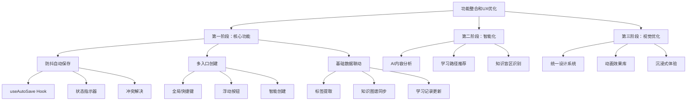
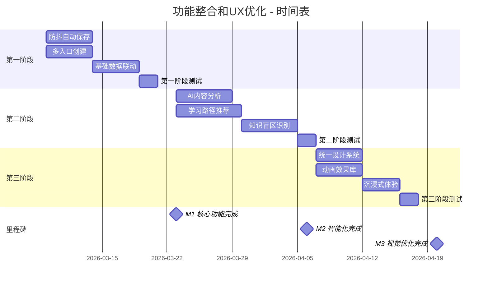

# 功能整合和用户体验优化 - 实施计划

**项目代号**: Integration & UX Optimization
**版本**: v1.0
**创建日期**: 2026-03-09
**计划周期**: 2026-03-09 至 2026-04-06 (4周)
**项目经理**: EduNexus 开发团队

---

## 📋 目录

1. [项目概览](#项目概览)
2. [工作分解结构 (WBS)](#工作分解结构-wbs)
3. [详细任务列表](#详细任务列表)
4. [里程碑和交付物](#里程碑和交付物)
5. [时间表](#时间表)
6. [资源分配](#资源分配)
7. [风险管理](#风险管理)

---

## 项目概览

### 项目目标

打通知识宝库、知识星图、成长地图三大功能，实现智能化学习体验，并全面优化视觉效果。

### 实施策略

采用渐进式实现，分三个阶段：
1. **第一阶段**（1-2周）：核心功能 - 防抖自动保存、多入口创建、基础数据联动
2. **第二阶段**（2-3周）：智能化 - AI 分析、路径推荐、盲区识别
3. **第三阶段**（1-2周）：视觉优化 - 设计系统、动画库、沉浸式体验

### 成功标准

- 所有核心功能按时交付
- 自动保存成功率 >99%
- 页面加载时间 <1秒
- 用户满意度 >4.5/5
- 代码测试覆盖率 >80%

---

## 工作分解结构 (WBS)

---

## 详细任务列表

### 第一阶段：核心功能（Week 1-2）

#### 1.1 防抖自动保存系统

| 任务ID | 任务名称 | 描述 | 预计工时 | 依赖 | 优先级 |
|--------|---------|------|---------|------|--------|
| T1.1.1 | 创建 useAutoSave Hook | 实现防抖自动保存逻辑 | 4h | - | P0 |
| T1.1.2 | 实现保存状态指示器 | 显示保存状态和时间 | 2h | T1.1.1 | P0 |
| T1.1.3 | 添加离线保存支持 | IndexedDB 离线存储 | 3h | T1.1.1 | P0 |
| T1.1.4 | 实现冲突检测 | 版本号比对和冲突提示 | 4h | T1.1.3 | P1 |
| T1.1.5 | 集成到知识库编辑器 | 替换现有保存逻辑 | 3h | T1.1.2 | P0 |
| T1.1.6 | 编写单元测试 | 测试各种保存场景 | 3h | T1.1.5 | P0 |

**验收标准**：
- ✅ 停止输入 2-3 秒后自动保存
- ✅ 保存状态实时显示
- ✅ 离线时保存到本地，联网后同步
- ✅ 冲突时提示用户选择版本
- ✅ 测试覆盖率 >80%

#### 1.2 多入口快速创建系统

| 任务ID | 任务名称 | 描述 | 预计工时 | 依赖 | 优先级 |
|--------|---------|------|---------|------|--------|
| T1.2.1 | 实现全局快捷键系统 | useGlobalShortcuts Hook | 3h | - | P0 |
| T1.2.2 | 创建浮动创建按钮 | 右下角浮动按钮组件 | 4h | - | P0 |
| T1.2.3 | 实现快速创建对话框 | 模态框 + 模板选择 | 5h | T1.2.1 | P0 |
| T1.2.4 | 添加智能创建功能 | 根据上下文推荐模板 | 4h | T1.2.3 | P1 |
| T1.2.5 | 集成到各个页面 | 全局可用 | 2h | T1.2.2, T1.2.3 | P0 |
| T1.2.6 | 编写单元测试 | 测试快捷键和创建流程 | 2h | T1.2.5 | P0 |

**验收标准**：
- ✅ Ctrl/Cmd + N 打开快速创建
- ✅ 浮动按钮在所有页面可见
- ✅ 支持空白笔记、AI 生成、模板创建
- ✅ 创建时间 <30秒
- ✅ 测试覆盖率 >80%

#### 1.3 基础数据联动

| 任务ID | 任务名称 | 描述 | 预计工时 | 依赖 | 优先级 |
|--------|---------|------|---------|------|--------|
| T1.3.1 | 实现标签自动提取 | 从内容中提取标签 | 3h | - | P0 |
| T1.3.2 | 实现关键词提取 | TF-IDF 算法 | 4h | - | P0 |
| T1.3.3 | 创建知识图谱同步服务 | 笔记 → 知识节点 | 5h | T1.3.1 | P0 |
| T1.3.4 | 创建学习记录服务 | 记录学习行为 | 3h | - | P0 |
| T1.3.5 | 集成到保存流程 | 保存时自动触发 | 3h | T1.3.3, T1.3.4 | P0 |
| T1.3.6 | 编写集成测试 | 测试完整数据流 | 3h | T1.3.5 | P0 |

**验收标准**：
- ✅ 保存笔记时自动提取标签和关键词
- ✅ 自动创建/更新知识图谱节点
- ✅ 学习记录实时更新
- ✅ 数据同步成功率 >95%
- ✅ 测试覆盖率 >80%

### 第二阶段：智能化（Week 3-4）

#### 2.1 AI 笔记内容分析

| 任务ID | 任务名称 | 描述 | 预计工时 | 依赖 | 优先级 |
|--------|---------|------|---------|------|--------|
| T2.1.1 | 创建 AI 分析服务 | ModelScope API 集成 | 4h | - | P0 |
| T2.1.2 | 实现内容摘要生成 | 自动生成 100 字摘要 | 3h | T2.1.1 | P0 |
| T2.1.3 | 实现概念提取 | 提取核心概念和定义 | 4h | T2.1.1 | P0 |
| T2.1.4 | 实现难度评估 | 评估内容难度等级 | 3h | T2.1.1 | P1 |
| T2.1.5 | 实现相关文档推荐 | 基于内容相似度 | 5h | T2.1.3 | P1 |
| T2.1.6 | 创建分析结果展示 | UI 组件 | 4h | T2.1.2 | P0 |
| T2.1.7 | 编写单元测试 | 测试分析准确性 | 3h | T2.1.6 | P0 |

**验收标准**：
- ✅ 自动生成准确的内容摘要
- ✅ 提取 5-10 个关键概念
- ✅ 难度评估准确率 >70%
- ✅ 相关文档推荐准确率 >80%
- ✅ 分析时间 <5秒

#### 2.2 智能学习路径推荐

| 任务ID | 任务名称 | 描述 | 预计工时 | 依赖 | 优先级 |
|--------|---------|------|---------|------|--------|
| T2.2.1 | 创建知识状态分析 | 分析用户知识掌握度 | 5h | - | P0 |
| T2.2.2 | 实现目标需求分析 | 分析目标所需知识 | 4h | - | P0 |
| T2.2.3 | 实现知识差距识别 | 对比当前和目标 | 4h | T2.2.1, T2.2.2 | P0 |
| T2.2.4 | 实现路径生成算法 | 生成学习路径 | 6h | T2.2.3 | P0 |
| T2.2.5 | 创建路径可视化 | React Flow 展示 | 5h | T2.2.4 | P0 |
| T2.2.6 | 实现路径调整 | 动态调整路径 | 4h | T2.2.4 | P1 |
| T2.2.7 | 编写集成测试 | 测试推荐准确性 | 3h | T2.2.6 | P0 |

**验收标准**：
- ✅ 准确识别知识差距
- ✅ 生成合理的学习路径
- ✅ 路径可视化清晰易懂
- ✅ 推荐准确率 >75%
- ✅ 生成时间 <10秒

#### 2.3 知识盲区识别

| 任务ID | 任务名称 | 描述 | 预计工时 | 依赖 | 优先级 |
|--------|---------|------|---------|------|--------|
| T2.3.1 | 实现节点连接度分析 | 分析知识图谱结构 | 4h | - | P0 |
| T2.3.2 | 实现掌握度评估 | 基于学习记录 | 4h | - | P0 |
| T2.3.3 | 实现盲区识别算法 | 识别薄弱环节 | 5h | T2.3.1, T2.3.2 | P0 |
| T2.3.4 | 生成推荐行动 | 针对性学习建议 | 4h | T2.3.3 | P0 |
| T2.3.5 | 创建盲区展示页面 | 可视化展示 | 5h | T2.3.4 | P0 |
| T2.3.6 | 实现进度追踪 | 追踪改进进度 | 3h | T2.3.5 | P1 |
| T2.3.7 | 编写单元测试 | 测试识别准确性 | 3h | T2.3.6 | P0 |

**验收标准**：
- ✅ 准确识别知识盲区
- ✅ 提供针对性建议
- ✅ 盲区可视化清晰
- ✅ 识别准确率 >80%
- ✅ 测试覆盖率 >80%

### 第三阶段：视觉优化（Week 5-6）

#### 3.1 统一设计系统

| 任务ID | 任务名称 | 描述 | 预计工时 | 依赖 | 优先级 |
|--------|---------|------|---------|------|--------|
| T3.1.1 | 定义设计令牌 | 颜色、间距、字体 | 3h | - | P0 |
| T3.1.2 | 创建组件库 | 基础 UI 组件 | 6h | T3.1.1 | P0 |
| T3.1.3 | 统一现有组件样式 | 应用设计令牌 | 8h | T3.1.2 | P0 |
| T3.1.4 | 创建主题系统 | 支持浅色/深色主题 | 4h | T3.1.1 | P1 |
| T3.1.5 | 编写设计文档 | Storybook 文档 | 4h | T3.1.3 | P1 |

**验收标准**：
- ✅ 设计令牌完整定义
- ✅ 所有页面样式统一
- ✅ 支持主题切换
- ✅ 组件库文档完整

#### 3.2 动画效果库

| 任务ID | 任务名称 | 描述 | 预计工时 | 依赖 | 优先级 |
|--------|---------|------|---------|------|--------|
| T3.2.1 | 创建基础动画组件 | FadeIn, SlideIn, ScaleIn | 4h | - | P0 |
| T3.2.2 | 实现页面过渡动画 | 路由切换动画 | 3h | T3.2.1 | P0 |
| T3.2.3 | 实现列表动画 | 列表项进入/退出 | 3h | T3.2.1 | P0 |
| T3.2.4 | 实现加载动画 | 骨架屏、加载指示器 | 4h | T3.2.1 | P0 |
| T3.2.5 | 应用到各个页面 | 全局动画效果 | 6h | T3.2.2, T3.2.3 | P0 |
| T3.2.6 | 性能优化 | 减少重绘和回流 | 3h | T3.2.5 | P1 |

**验收标准**：
- ✅ 所有页面有流畅动画
- ✅ 动画时长合理（<500ms）
- ✅ 无性能问题
- ✅ 支持动画开关

#### 3.3 沉浸式体验优化

| 任务ID | 任务名称 | 描述 | 预计工时 | 依赖 | 优先级 |
|--------|---------|------|---------|------|--------|
| T3.3.1 | 实现全屏编辑模式 | 全屏切换 | 3h | - | P0 |
| T3.3.2 | 实现专注模式 | 隐藏侧边栏 | 2h | - | P0 |
| T3.3.3 | 实现禅模式 | 极简界面 | 4h | T3.3.1 | P1 |
| T3.3.4 | 实现打字机模式 | 当前行居中 | 3h | - | P1 |
| T3.3.5 | 添加模式切换 | 快捷键和按钮 | 2h | T3.3.1, T3.3.2 | P0 |
| T3.3.6 | 编写用户指南 | 功能说明 | 2h | T3.3.5 | P1 |

**验收标准**：
- ✅ 支持多种编辑模式
- ✅ 模式切换流畅
- ✅ 快捷键正常工作
- ✅ 用户指南清晰

---

## 里程碑和交付物

### 里程碑 M1：核心功能完成（Week 2 结束）

**日期**: 2026-03-23

**交付物**：
- ✅ 防抖自动保存系统（含测试）
- ✅ 多入口快速创建系统（含测试）
- ✅ 基础数据联动（含测试）
- ✅ 第一阶段测试报告
- ✅ 用户使用文档

**验收标准**：
- 所有 P0 任务完成
- 测试覆盖率 >80%
- 无阻塞性 Bug
- 通过内部测试

### 里程碑 M2：智能化功能完成（Week 4 结束）

**日期**: 2026-04-06

**交付物**：
- ✅ AI 内容分析服务（含测试）
- ✅ 学习路径推荐系统（含测试）
- ✅ 知识盲区识别（含测试）
- ✅ 第二阶段测试报告
- ✅ API 文档

**验收标准**：
- 所有 P0 任务完成
- AI 分析准确率 >75%
- 推荐准确率 >80%
- 无阻塞性 Bug

### 里程碑 M3：视觉优化完成（Week 6 结束）

**日期**: 2026-04-20

**交付物**：
- ✅ 统一设计系统
- ✅ 动画效果库
- ✅ 沉浸式编辑体验
- ✅ 完整测试报告
- ✅ 用户指南和视频教程

**验收标准**：
- 所有任务完成
- 视觉效果统一
- 动画流畅无卡顿
- 用户满意度 >4.5/5

---

## 时间表

### 甘特图

### 每周计划

**Week 1 (2026-03-09 ~ 2026-03-15)**
- 防抖自动保存系统开发
- 多入口快速创建系统开发
- 每日站会和进度同步

**Week 2 (2026-03-16 ~ 2026-03-22)**
- 基础数据联动开发
- 第一阶段集成测试
- 内部演示和反馈收集

**Week 3 (2026-03-23 ~ 2026-03-29)**
- AI 内容分析开发
- 学习路径推荐开发
- 中期评审

**Week 4 (2026-03-30 ~ 2026-04-05)**
- 知识盲区识别开发
- 第二阶段集成测试
- 性能优化

**Week 5 (2026-04-07 ~ 2026-04-13)**
- 统一设计系统
- 动画效果库开发
- UI/UX 评审

**Week 6 (2026-04-14 ~ 2026-04-20)**
- 沉浸式体验优化
- 最终测试和修复
- 文档编写和发布准备

---

## 资源分配

### 人员配置

| 角色 | 人数 | 职责 |
|------|------|------|
| 前端开发 | 2 | 功能开发、UI 实现 |
| 后端开发 | 1 | API 开发、数据服务 |
| UI/UX 设计师 | 1 | 设计系统、视觉优化 |
| 测试工程师 | 1 | 测试、质量保证 |
| 项目经理 | 1 | 项目管理、协调 |

### 工时预算

| 阶段 | 预计工时 | 实际工时 | 偏差 |
|------|---------|---------|------|
| 第一阶段 | 80h | - | - |
| 第二阶段 | 120h | - | - |
| 第三阶段 | 80h | - | - |
| 测试和修复 | 40h | - | - |
| **总计** | **320h** | - | - |

---

## 风险管理

### 风险登记表

| 风险ID | 风险描述 | 影响 | 概率 | 应对策略 | 负责人 |
|--------|---------|------|------|---------|--------|
| R1 | AI API 限流导致功能不可用 | 高 | 中 | 实现请求队列和缓存机制 | 后端开发 |
| R2 | 性能问题导致用户体验下降 | 高 | 中 | 代码分割、懒加载、性能监控 | 前端开发 |
| R3 | 数据同步冲突 | 中 | 中 | 版本控制和冲突解决机制 | 后端开发 |
| R4 | 开发周期延长 | 中 | 高 | MVP 优先、敏捷开发 | 项目经理 |
| R5 | 用户接受度低 | 高 | 低 | 用户测试、快速迭代 | UI/UX 设计师 |
| R6 | 浏览器兼容性问题 | 中 | 低 | 提供降级方案、充分测试 | 前端开发 |

### 风险应对计划

**R1: AI API 限流**
- **预防措施**：实现请求队列、设置合理的请求频率
- **应急措施**：使用本地缓存、降级到基础功能
- **监控指标**：API 调用成功率、响应时间

**R2: 性能问题**
- **预防措施**：代码审查、性能测试、优化关键路径
- **应急措施**：回滚到稳定版本、紧急优化
- **监控指标**：页面加载时间、FPS、内存使用

**R4: 开发周期延长**
- **预防措施**：每日站会、及时沟通、任务拆分
- **应急措施**：调整优先级、增加资源、延后 P1 任务
- **监控指标**：任务完成率、燃尽图

---

## 质量保证

### 测试策略

1. **单元测试**：每个功能模块 >80% 覆盖率
2. **集成测试**：测试模块间交互
3. **E2E 测试**：测试关键用户流程
4. **性能测试**：页面加载、API 响应时间
5. **兼容性测试**：主流浏览器测试
6. **用户测试**：内部用户试用和反馈

### 代码审查

- 所有代码必须经过 Code Review
- 使用 ESLint 和 Prettier 保证代码质量
- 遵循 TypeScript 最佳实践
- 编写清晰的代码注释

---

## 沟通计划

### 会议安排

| 会议类型 | 频率 | 参与者 | 目的 |
|---------|------|--------|------|
| 每日站会 | 每天 | 全体开发人员 | 同步进度、识别阻塞 |
| 周会 | 每周 | 全体团队 | 回顾和计划 |
| 评审会 | 每阶段 | 全体团队 + 利益相关者 | 演示和反馈 |
| 回顾会 | 每阶段 | 全体团队 | 总结经验教训 |

### 报告机制

- **日报**：每日进度更新
- **周报**：每周总结和下周计划
- **阶段报告**：每个阶段的详细报告
- **最终报告**：项目完成总结

---

**文档版本**: v1.0
**最后更新**: 2026-03-09
**下一次审查**: 2026-03-16
