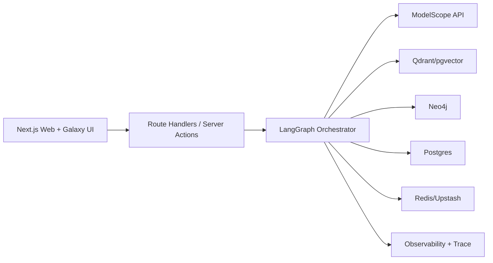

# EduNexus V2 方案：AI 教育生态战略可视化平台（Web-Only）

> 版本定位：在 `edu-nexus-langgraph-vercel-plan.md` 基础上升级为 V2，明确「只做 Web 端」「不做拍照搜题捷径」「融合 Obsidian + NotebookLM 特性与美学」。

---

## 0. 本次升级要点（相对 V1）

- 产品边界升级：从“AI 教育产品集合”升级为“**AI 教育生态战略可视化平台**”。
- 交互原则升级：从“给答案”转为“**引导学会**”，反对一拍即答、直接抄答案习惯。
- 形态升级：只做 Web，不做原生 App，不走拍照搜题竞争赛道。
- 体验升级：引入 Obsidian 的知识网络工作流 + NotebookLM 的来源可信问答机制。
- 架构延续：继续坚持 LangChain + LangGraph + ModelScope + GitHub + Vercel。

---

## 1. 北极星定位与产品主张

### 1.1 北极星定位
**EduNexus = AI 教育生态战略可视化平台（Web）**

核心不是“题目秒解器”，而是“**知识建构与学习决策系统**”：
- 帮学生构建知识地图、形成可迁移能力；
- 帮教师做学情洞察、教学决策、教研协同；
- 帮成人学习者做项目式成长与能力证明；
- 帮机构形成可追踪、可评估、可复用的教育数据资产。

### 1.2 产品价值主张
- **学习效果优先**：不鼓励跳过思考直接拿答案。
- **可解释优先**：每条建议都能追溯来源和知识点。
- **过程数据优先**：关注“如何学会”，不是“是否提交过”。
- **生态协同优先**：学生-教师-成人学习-文化内容共用知识底座。

---

## 2. 五大方向融合战略（你给的排名落地版）

| 排名 | 子方向 | 2026 机会判断 | 平台融合方式 | 阶段优先级 |
|---|---|---|---|---|
| 1 | AI错题诊断 + 动态知识图谱 + 自适应路径 | 政策与需求双强，最易形成闭环价值 | 作为全平台主引擎（Learning Graph Engine） | P0 |
| 2 | AI + 大学生/成人学习（编程/考研/职考/职业技能） | 增长快、付费意愿强、易避开 K12 红海 | 作为 Career/Skill 子域，项目制学习与面试模拟 | P0 |
| 3 | 多模态情绪/心理健康 + 学习陪伴 | 社会价值高，差异化明显 | 作为 Companion 子域，默认轻量化非医疗定位 | P1 |
| 4 | AI 教师减负工具（备课/批改/教研） | B 端落地真实，便于合作试点 | 作为 TeacherOS 子域，与班级图谱联动 | P1 |
| 5 | GenAI + 国学/传统文化/非遗 | 创意与政策协同，利于品牌与赛事展示 | 作为 Culture Lab 子域，形成内容特色壁垒 | P2 |

说明：
- 你不是做五个孤立产品，而是做一个“**统一知识底座 + 多场景入口**”的生态平台。
- 建议先打穿 P0（学习图谱+成人技能），再叠加 P1（陪伴+教师），最后扩展 P2（文化）。

---

## 3. 明确“不做什么”（战略减法）

- 不做原生 App（iOS/Android），避免多端维护成本与节奏分散。
- 不做“拍照搜题秒给答案”的主流程，不卷题库竞赛与识别竞速。
- 不做“唯聊天框”产品，不把学习降级为无结构问答。
- 不做“黑盒 AI 判分”，所有关键结论要可解释可追溯。

---

## 4. Obsidian × NotebookLM 融合设计

### 4.1 借鉴 Obsidian 的特性（知识网络工作流）
- 双向链接：`[[概念A]] -> [[概念B]]`，自动形成知识网。
- 反向链接：每个知识点看到“被哪些笔记/任务引用”。
- Graph View：全局图谱 + 局部图谱（按学科、时间、难度过滤）。
- Canvas 模式：拖拽卡片组织“学习论证链”与“解题路径链”。
- Markdown First：所有学习笔记可导出为结构化 Markdown。

### 4.2 借鉴 NotebookLM 的特性（来源可信学习）
- Source-grounded 问答：回答必须绑定引用来源（教材段落、讲义、课堂记录）。
- Notebook 容器：每门课/项目拥有独立知识上下文与记忆。
- 引文卡片：回答中的关键结论附 `source_id + chunk_ref`。
- 多源对读：同一概念在多份资料中的差异与共识对比。
- 学习摘要：自动生成“本周知识演化摘要 + 下周建议”。

### 4.3 二者融合后的“EduNexus 学习中枢”
- 左侧：知识库与笔记树（Obsidian 风格）。
- 中央：学习工作台（任务、推理、图谱、对话切换）。
- 右侧：来源证据栏（NotebookLM 风格引用与原文对照）。
- 底部：学习节奏与掌握度时间线（FSRS + 行为轨迹）。

---

## 5. 产品信息架构（Web-Only）

```txt
/
  /dashboard           生态总览与战略看板
  /workspace           学习主工作区（笔记+任务+对话+证据）
  /graph               知识图谱（全局/局部/班级）
  /path                自适应学习路径与复习计划
  /teacher             教师工作台（备课/批改/教研）
  /career              成人技能与项目式学习
  /companion           学习陪伴与状态洞察
  /culture             国学/非遗内容实验室
  /admin               平台治理与数据策略
```

关键说明：
- 全平台仅 Web 入口，PC 优先，平板兼容，手机只做轻量浏览。
- 不提供“拍照搜题直接答案”入口；若保留 OCR，仅用于资料数字化与学习笔记结构化。

---

## 6. 反“答案捷径”学习机制（核心差异化）

### 6.1 默认机制：Socratic 引导，不直接报答案
每次求解分四级解锁：
1. **概念提醒**：先提示相关知识点与先验条件；
2. **思路骨架**：给解法框架，不给最终结果；
3. **关键步骤检查**：针对用户提交步骤反馈；
4. **最终答案解锁**：仅在完成反思题后可见（可由教师策略控制）。

### 6.2 防抄写策略
- 必填“我的当前思路”后才能进入下一提示层级。
- 限制连续“直接要答案”行为，自动转入启发式问答。
- 记录“独立完成率、提示依赖率、反思完成率”，作为学习评价维度。

### 6.3 教师可配置策略
- 班级级别开关：考试周可设置“严格引导模式”。
- 学段策略：K12 比成人更严格限制直接答案。
- 透明可解释：每次限制都给出学习目标解释，而不是简单拒绝。

---

## 7. 生态模块蓝图（融合而不是堆功能）

### 7.1 Learning Graph Engine（P0）
- 输入：学习任务、笔记、作业过程、错因标签。
- 输出：动态知识图谱、薄弱点、复习优先队列、路径重排。
- 角色：全平台“知识底盘”，其他模块都从这里取数。

### 7.2 Career & Skill Studio（P0）
- 项目制学习路径（编程/数据分析/职考）。
- 代码任务与面试模拟，输出能力画像与证据链。
- 与 Learning Graph 同步，形成“从知识到能力”的迁移链路。

### 7.3 Companion（P1）
- 轻量多模态状态洞察（专注、疲劳、挫败感趋势）。
- 动态节奏建议（休息、降难、复盘）。
- 明确非医疗定位，强调学习支持与风险提示。

### 7.4 TeacherOS（P1）
- 备课/批改/教研协同，基于班级图谱实时反馈。
- 产出可复用教学资产（教案、题组、讲评模板）。
- 通过证据引用机制提高可审查性与可信度。

### 7.5 Culture Lab（P2）
- 文言文助教、典籍对读、非遗知识卡与叙事学习。
- 作为平台品牌差异化与赛事亮点扩展模块。

---

## 8. LangGraph 工作流设计（去 Dify，纯代码编排）

### 8.1 通用状态结构（建议）
- `user_profile`
- `learning_goal`
- `source_context`
- `reasoning_trace`
- `graph_updates`
- `intervention_plan`
- `citations`
- `final_response`

### 8.2 核心工作流 A：学习引导流（不直接给答案）
1. `intent_detect_node`：判断是求解、复盘、拓展还是作弊倾向请求。
2. `source_retrieve_node`：检索来源资料与历史学习记录。
3. `socratic_plan_node`：生成分层引导计划。
4. `step_check_node`：校验用户提交步骤，给纠偏反馈。
5. `answer_gate_node`：根据策略决定是否开放最终答案。
6. `graph_update_node`：更新知识节点掌握度与关系边权。
7. `summary_node`：产出“本次学到了什么 + 下次做什么”。

### 8.3 核心工作流 B：教师决策流
1. 班级薄弱点聚类；
2. 目标导向备课生成；
3. 作业批改与高频错因提炼；
4. 下节课教学策略建议；
5. 资料/报告导出。

### 8.4 核心工作流 C：成人项目成长流
1. 能力诊断；
2. 项目拆解；
3. 阶段任务推进；
4. 面试模拟复盘；
5. 形成可展示能力档案。

---

## 9. 技术架构（Web + Vercel 优先）



### 9.1 技术选型建议
- 前端：Next.js App Router + TypeScript + Galaxy UI 封装层。
- 工作流：LangChain + LangGraph（JS/TS 主实现，便于 Vercel 一体化）。
- 模型：ModelScope OpenAI 兼容接口（DeepSeek/Qwen 路由可配）。
- 数据：Postgres + Neo4j + 向量库（Qdrant 或 pgvector）。
- 异步：Inngest/QStash 处理长任务（批量生成、批改、报告）。

### 9.2 ModelScope 接入约束
- 服务端调用，前端禁止直连。
- `MODELSCOPE_API_KEY` 仅存储在 Vercel 环境变量。
- 支持模型路由策略：低成本模型默认，高复杂任务切换高性能模型。

---

## 10. Galaxy UI + Obsidian/NotebookLM 美学规范

### 10.1 视觉方向（建议）
- 关键词：`Scholar Dark`、`Knowledge Editorial`、`Calm Tech`.
- 气质：沉浸、专业、理性，不做炫技式“AI 霓虹面板”。

### 10.2 布局规则
- 采用“三栏知识工作台”作为核心骨架（导航 / 工作区 / 证据栏）。
- 图谱页面强调“探索感”，工作台页面强调“专注感”。
- 所有 AI 输出必须与来源卡片同屏可见，提升信任。

### 10.3 组件策略
- 在 `packages/ui` 内封装 Galaxy 业务组件：
  - `KnowledgeGraphPanel`
  - `CitationDrawer`
  - `SocraticStepCard`
  - `LearningTimeline`
  - `ClassHeatmapBoard`

---

## 11. 数据与评价体系（从“答对率”升级）

### 11.1 核心指标
- 学习增益：单位时间掌握度提升。
- 过程质量：独立完成率、反思完成率、提示依赖率。
- 迁移能力：跨题型、跨场景复用能力。
- 教师收益：备课/批改节省时长。
- 生态活性：跨模块复用率（学习-教师-成人）。

### 11.2 反作弊与可信指标
- 直接答案请求比例；
- 低输入高输出异常会话占比；
- 无证据回答比例（目标趋近 0）；
- 模型幻觉拦截率。

---

## 12. 12 周执行路线图（Web 平台版）

### Phase 1（第 1-4 周）：平台底座 + P0 首链路
- 搭建 Web 平台骨架、Galaxy 主题、三栏工作区。
- 跑通“学习引导流”最小闭环（含答案分层解锁）。
- 建立 Obsidian 风格笔记双链 + 图谱视图基础版。

### Phase 2（第 5-8 周）：P0 完整化 + P1 试运行
- 完成成人项目学习与面试复盘链路。
- 上线 NotebookLM 风格来源引用与证据栏。
- TeacherOS 备课/班级洞察基础功能上线。

### Phase 3（第 9-12 周）：生态打磨 + 展示增强
- Companion 模块接入（轻量状态洞察）。
- 文化实验室首个专题上线（国学/非遗之一）。
- 完成战略可视化大屏（生态数据飞轮、学习成效看板）。

---

## 13. GitHub -> Vercel 无缝部署方案

### 13.1 仓库与分支
- `main`：生产自动部署。
- `feature/*`：PR 自动预览环境。

### 13.2 CI 门禁
- `lint` / `typecheck` / `test` / `build` 必须全绿。
- 合并前强制检查：Schema 变更与 Prompt 变更说明。

### 13.3 Vercel 环境分层
- Development：本地联调。
- Preview：PR 验证设计与流程。
- Production：对外演示/试点。

---

## 14. 风险与规避

- 风险：用户仍希望“直接要答案”。
  - 规避：产品文案、流程与激励机制统一强调“能力成长”。
- 风险：多模块导致早期开发发散。
  - 规避：严格 P0->P1->P2 分期，不跨阶段并发扩张。
- 风险：来源引用链路复杂影响响应速度。
  - 规避：缓存高频资料块 + 分层检索 + 结果重排裁剪。
- 风险：图谱质量依赖数据标注。
  - 规避：先做半自动标注与教师校对闭环。

---

## 15. 第一批可执行任务清单（建议本周）

1. 输出品牌与体验基线文档：确认 Obsidian × NotebookLM 风格词典与页面结构。
2. 初始化 `apps/web` 与 `packages/ui`，搭建三栏工作台框架。
3. 实现 LangGraph `学习引导流` MVP（含答案分层解锁策略）。
4. 接入 ModelScope 服务端调用与流式输出（不暴露 API Key）。
5. 建立“来源引用卡片”协议（`citation_id / source_id / chunk_ref`）。
6. 打通 GitHub Actions + Vercel Preview，确保每次 PR 可在线验收。

---

## 16. 一句话版本（对外路演可用）

**EduNexus 不是“拍照拿答案”的工具，而是一个融合知识图谱、来源可信推理和学习引导机制的 Web 教育生态平台，帮助学习者真正学会、帮助教师真正看见学习过程。**
